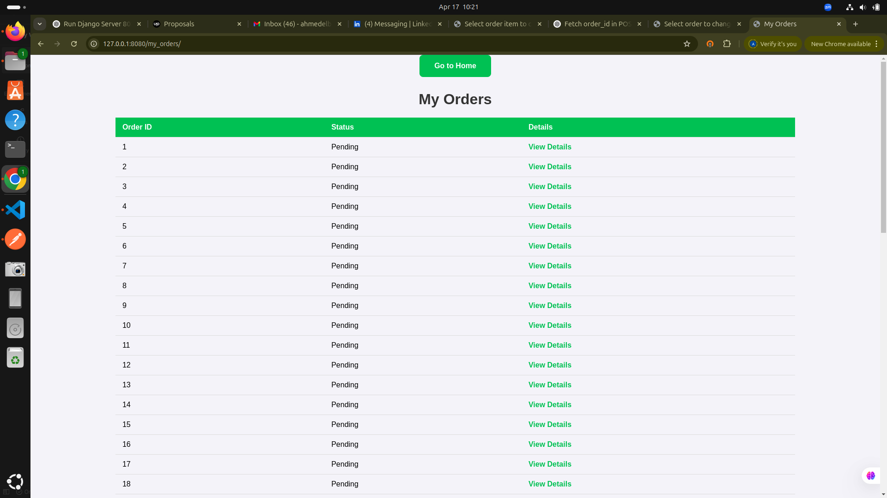
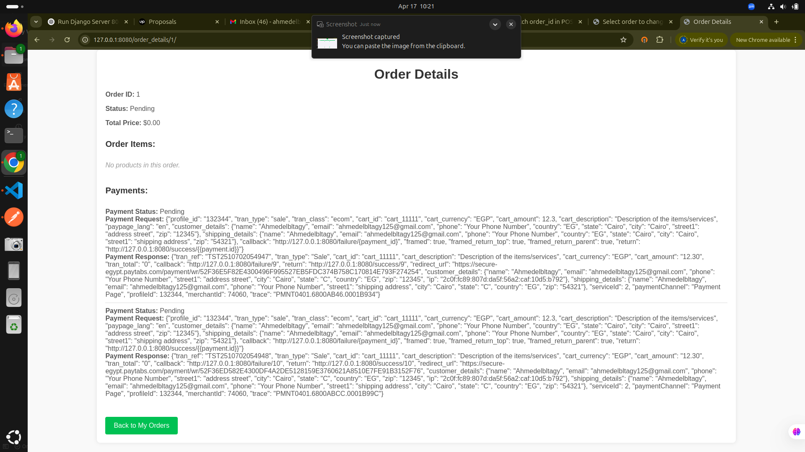
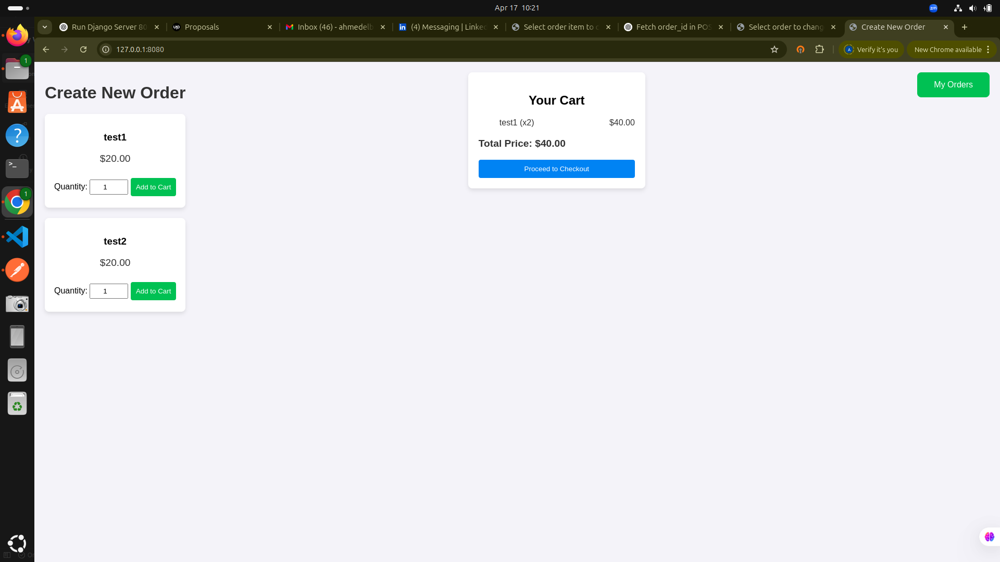
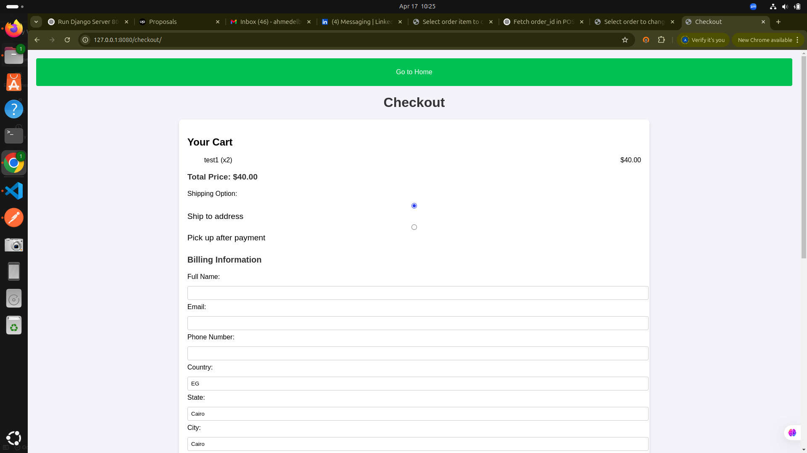
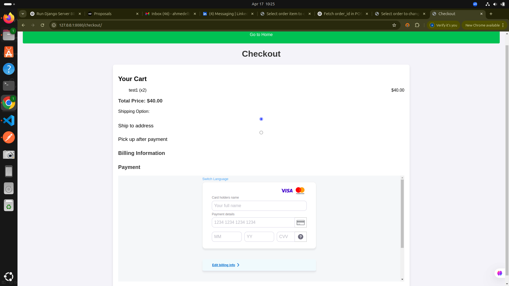

PayTabs Checkout System

This project is a simple, functional web-based Order Management and Payment Processing System using Django, designed as part of a technical assessment for PayTabs.
Overview

The project includes:

    Order Management: Display all past orders stored in the database.

    Order Details: Show order details including payment request payloads, responses, and refund history.

    Create New Order: Allow users to add products to the cart and proceed to checkout.

    Checkout and Payment: Implement payment processing via PayTabs' iFrame payment mode without page redirection.

Technologies Used

    Backend: Django (Python)

    Frontend: HTML, CSS, and JavaScript (AJAX for dynamic page content)

    Database: SQLite (or any preferred database)

    Payment Gateway: PayTabs (using Hosted Payment Page via iFrame mode)

    Version Control: Git

Installation and Setup

Follow these steps to set up the project locally:
1. Clone the Repository

git clone (https://github.com/Elbltagy2/PayTabs-Checkout-System.git)
cd PayTabs-Checkout-System

2. Set Up the Virtual Environment

Create a virtual environment:

python -m venv venv
source venv/bin/activate  # For Windows: venv\Scripts\activate

3. Install Dependencies

Install the required Python packages:

pip install -r requirements.txt

4. Database Migrations

Run the migrations to set up the database:

python manage.py migrate

5. Start the Development Server

Run the server locally:

python manage.py runserver 8080

The application will be available at http://127.0.0.1:8080/.
Project Structure

    myproject/: The main project folder.

    orders/: Contains the application for handling orders, products, and payments.

        models.py: Defines the models for Order, OrderItem, and Product.

        views.py: Handles the logic for order creation, payment processing, and serving the appropriate views.

        urls.py: Defines URL routing for the views.

        templates/: Contains HTML templates for rendering order details, checkout, and payment iframe.

        static/: Contains the CSS and JavaScript for styling and frontend logic.

    db.sqlite3: The SQLite database file for storing the project's data.

    manage.py: Django's utility script for managing the project (migrations, server, etc.).

Features
1. My Orders

Displays all past orders stored in the database, including the order ID, status, and a link to view order details.

2. Order Details Page

Displays detailed information for each order, including:

    The payment request payload and response payload.

    Refund requests history (if any).

3. Create New Order

Allows the user to:

    Add products (pre-stored in the database) to the cart.

    Proceed to checkout with a summary of the cart.
    [Alt text](/myproject/images/1)

4. Checkout and Payment

    Displays the order summary and collects billing and shipping information.

    Integrates with PayTabs' Hosted Payment Page to process payments without page redirection.

    Uses AJAX to load the payment form dynamically in an iframe.
    
    
    

Database Design

The system uses the following models:

    Product: Represents the products available for purchase, with fields like name and price.

    Order: Represents a user's order with fields like status and total_price.

    OrderItem: Represents an individual product within an order, including quantity and price.

    Payment: Stores information about payments related to orders, including the request and response payloads from PayTabs.

Payment Integration

The payment processing is integrated using PayTabs API. The system allows the user to:

    Proceed with payments via PayTabs' Hosted Payment Page in an iframe.

    Send payment details including customer and shipping information.

    Redirect the user to success or failure pages based on the payment result.

The required PayTabs credentials are:

    Profile ID: 132344

    Integration Key: SWJ992BZTN-JHGTJBWDLM-BZJKMR2ZHT

    Instance: Egypt

AJAX Implementation

AJAX is used to load the PayTabs payment form dynamically within the checkout page, eliminating the need for a page redirect. The payment form is embedded as an iframe and populated with the necessary data from the backend.
Flow:

    The user adds products to the cart.

    The cart data is sent to the backend to create a new order.

    Once the order is created, the backend returns the order ID.

    The user proceeds to payment, where AJAX is used to send the payment details.

    The PayTabs payment iframe is loaded dynamically, and the user completes the payment.

    Upon payment success, the order status is updated to Paid.

Security

    CSRF Protection: Django's built-in CSRF protection is used to secure form submissions.

    HTTPS: For secure communication, PayTabs should be integrated using HTTPS in production.